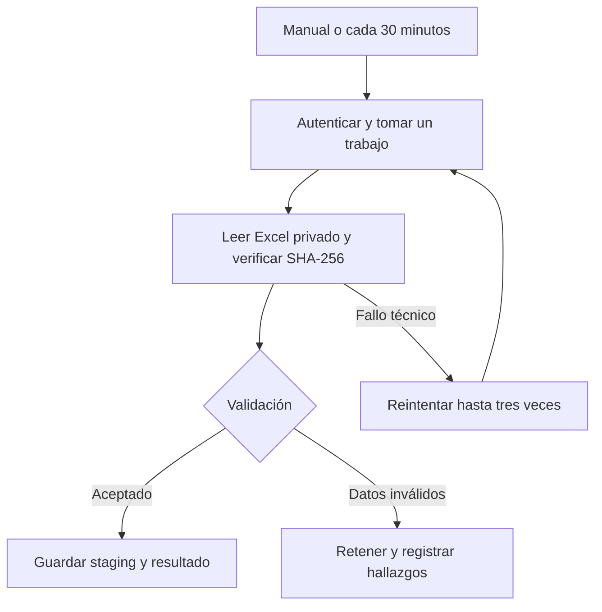

# Molino Control · flujo n8n de importación segura

Estado comprobado: 23-09-2026.

## Qué está hecho y qué falta

| Componente | Estado |
|---|---|
| Cola, permisos y funciones en Supabase | Migración `n8n_scoped_queue_gateway` aplicada |
| Entrada `molino-n8n-trigger` | Desplegada, ACTIVE, versión 1; llamadas sin token o con token inválido devuelven 401 |
| Workflow 03 | JSON completo, 15 nodos, referencias de credencial existentes; pendiente de importar en n8n |
| Parser y panel administrador | Código preparado en la rama `codex/n8n-integration-staging`; endpoint de producción todavía devuelve 404 |
| Activación y prueba completa en n8n | Pendiente: el acceso seguro fue rechazado por usuario/contraseña incorrectos |

Este estado no certifica que un workflow de producción esté ejecutándose. Los flujos 01 y 02 existentes no pudieron inspeccionarse en esta sesión.

## Recorrido

El administrador sube el archivo al bucket privado `excel-imports` usando su sesión real de Supabase Auth. `molino_enqueue_import` verifica el perfil admin, propiedad del archivo y checksum. La identidad del trabajo es usuario + tipo + checksum. Repetir la solicitud devuelve el mismo trabajo.

n8n primero comprueba la entrada y toma un trabajo. El procesador obtiene la ruta, tipo y checksum desde la base de datos, valida el archivo y guarda lotes de 200 filas. Las URL firmadas duran cinco minutos y se intercambian entre el procesador y Supabase, sin pasar por los datos de ejecución de n8n. El cierre compara los contadores con las filas realmente guardadas.

## Seguridad y recuperación

- n8n reutiliza `Molino Control RPC Token` en el almacén de credenciales. El JSON contiene su referencia, no su valor.
- `SUPABASE_SERVICE_ROLE_KEY` permanece en el entorno de la Edge Function. No se entrega a n8n, al parser ni al navegador.
- Las nuevas RPC del trabajador solo tienen EXECUTE para `service_role`. La entrada aplica autenticación, lista cerrada de acciones y límite atómico de 600 llamadas válidas por minuto. Este límite no protege por sí solo el tráfico anónimo previo a autenticación.
- Las funciones de usuario verifican `auth.uid()` y el rol admin en `perfiles`.
- Los trabajos usan bloqueo de base de datos, propietario de ejecución y lease de diez minutos. Un trabajador vencido no puede seguir escribiendo.
- Un reintento limpia exclusivamente las filas y hallazgos temporales del mismo trabajo. Los datos operacionales no se modifican.
- Hasta tres intentos, con espera creciente; el sondeo posterior recupera los fallos. Repetir la toma o el cierre por pérdida de una respuesta HTTP es idempotente.
- Archivos hasta 50 MiB; control de ZIP truncado, archivos cifrados, expansión excesiva y origen de la URL. Máximo de 100.000 filas sustantivas.
- Registro de request ID, acción y trabajo; sin tokens, URL firmadas ni filas del Excel en el log de la entrada.

## Resultado de las pruebas

- 19 pruebas automatizadas aprobadas: permisos, autenticación, límite de llamadas, propiedad del archivo, duplicados, lease, reintentos, cierre, errores de estructura, truncamiento y conservación de ceros.
- PostgreSQL 17 aislado mediante PGlite para las pruebas SQL. Las llamadas HTTP de los tests están simuladas.
- El pipeline de build existente terminó correctamente.
- Maestro real de 10.079.521 bytes: **14,287 filas**, **0 filas con error**, estado **validado**. Prueba local del lector con transporte simulado; no fue una importación en producción.
- Hallazgos del archivo: 40,714 advertencias de celdas, 0 errores y 0 errores fatales.
- Se corrigió la pérdida de resultados de fórmula iguales a cero en `cell.value` de ExcelJS 4.4.0 leyendo `cell.result`.
- Supabase en vivo confirmó que las nuevas RPC no son ejecutables por `anon` ni `authenticated`.

`validado` significa estructura y celdas cacheadas aceptadas. El resumen guarda `formulas_recalculated=false`, `business_rules_verified=false` y `publication_performed=false`. Este flujo no recalcula Excel ni certifica reglas NC, granel, fechas o promedios. Esas reglas deben pasar por el motor Maestro y sus comprobaciones antes de publicar.

## Instalación y puesta en marcha

1. Importar `n8n/molino-control-03-procesador-streaming.json` en la instancia Molino. Mantenerlo sin activar mientras se prueba.
2. Comprobar que todos los nodos HTTP reconocen la credencial existente `Molino Control RPC Token` (referencia `lFukJttBNR46Wnyg`). No pegar claves en parámetros.
3. Publicar la versión revisada de Vercel y verificar `/api/n8n-import-parser`: sin token debe devolver 401. En producción devolvía 404 al verificar esta entrega.
4. Con sesión real de administrador, subir un Excel controlado desde el panel de importación. El trabajo sintético histórico se excluye del procesador.
5. Ejecutar manualmente el workflow y contrastar el ID del trabajo, filas, hallazgos y estado final en Supabase.
6. Probar repetición del mismo archivo y rechazo de archivo inválido. Confirmar ausencia de escritura en tablas operacionales.
7. Activar. El intervalo inicial de 30 minutos supone hasta 1.488 ejecuciones programadas en un mes de 31 días, además de ejecuciones manuales y otros workflows; ajustarlo a la cuota contratada.

El flujo informa sus errores en n8n y en la cola. No envía correos ni mensajes a terceros; no se configuró un destinatario de alertas.

## Auditoría pendiente fuera de este flujo

Las RPC antiguas `n8n_create_import_job` y `n8n_register_connection_test` conservan acceso con token para no romper los flujos existentes antes del cambio. Hay que migrar esos consumidores a la entrada y entonces revocar EXECUTE a `anon`.

No se ha certificado la credencial del workflow 01 ni rotado ninguna clave: la sesión n8n bloqueada impidió inspeccionarlo. Tampoco se ha migrado el sistema RUT/PIN de la aplicación. El aviso de RLS sin políticas en tablas privadas y de staging refleja acceso directo denegado por diseño; no demuestra por sí solo una filtración.

## Archivos principales

- `n8n/molino-control-03-procesador-streaming.json`: flujo editable.
- `supabase/functions/molino-n8n-trigger/`: entrada autenticada.
- `supabase/migrations/20260921_n8n_scoped_queue.sql`: cola y permisos.
- `api/n8n-import-parser.js`: lector streaming y validaciones.
- `tests/n8n-*.test.cjs`: pruebas; ejecutar `npm ci` y `npm run test:n8n`.

Para detener el procesador basta desactivar el workflow. La cola y los archivos privados se conservan para diagnóstico. No borrar las tablas como mecanismo de rollback.
